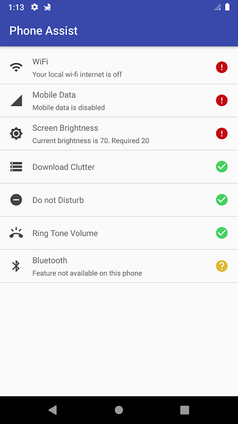
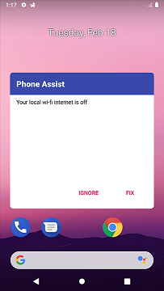

# Phone Assist

A simple android device assistant application.

## Features

Tracks:
* Network connection (WiFi, Mobile Data)
* Blutooth status
* Brightness threshold
* Download folder file clutter (unwanted files, like html pages accidentally downloaded)
* Dot not Disturb mode
* Ring tone volume (also tracks silent and vibrate states)
* Airplane mode (*to be implemented*)

## Implementations
It uses a foreground service that listen via brodcast receivers, content any changes regarding the aforementioned features. This is done via broadcast receivers, content observers or system callbacks. The service suscribes its listeners in 10 seconds after the device screen is on and unsubcribe when the screen if off.

The service is can also survive system reboot. It also host the broadcast receiver that fixes the tracked features.

Notifications to user are done using main ui or through an overlay dialog when the app is background (the app must have permission the draw over other apps though), backed up by specific prioritized broadcast receivers.

### Miscellaneous
* Androidx Components: LiveData, ViewModel, Ktx
* Kotlin: Coroutines-Flow

## Screenshots
 

## License
[MIT](https://choosealicense.com/licenses/mit/)