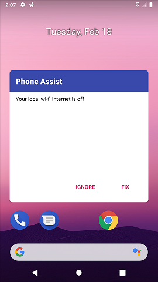

# Phone Assist

A simple android device assistant application.

## Features

Tracks:
* Network connection (WiFi, Mobile Data)
* Blutooth status
* Brightness threshold
* Download folder file clutter (unwanted files, like html pages accidentaly downloaded)
* Dot not Disturb mode
* Ring tone volume (also tracks silent and vibrate states)
* Airplane mode (*to be implemented*)

## Screenshots
 

## License
[MIT](https://choosealicense.com/licenses/mit/)